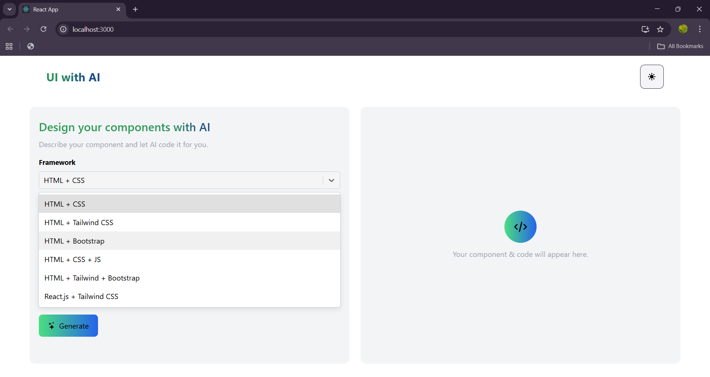
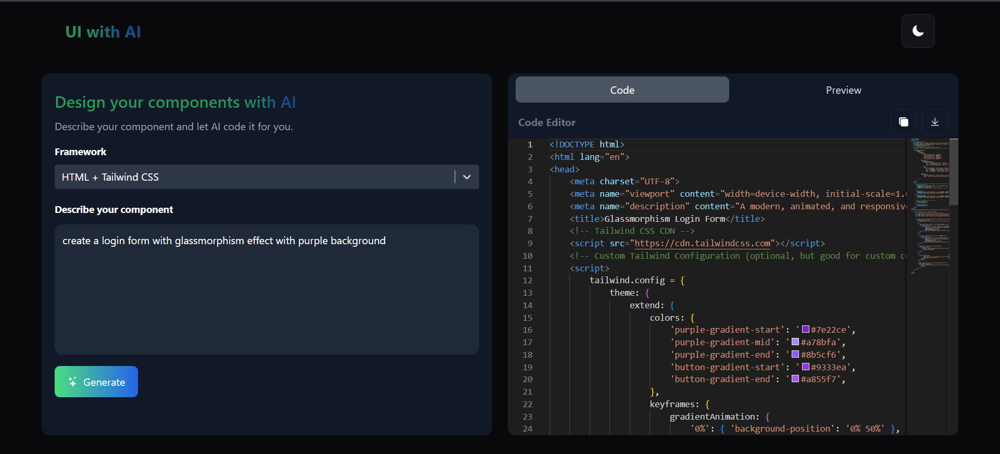
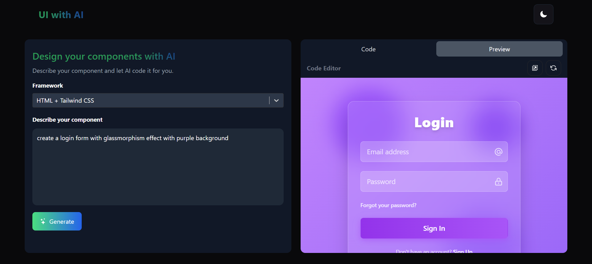
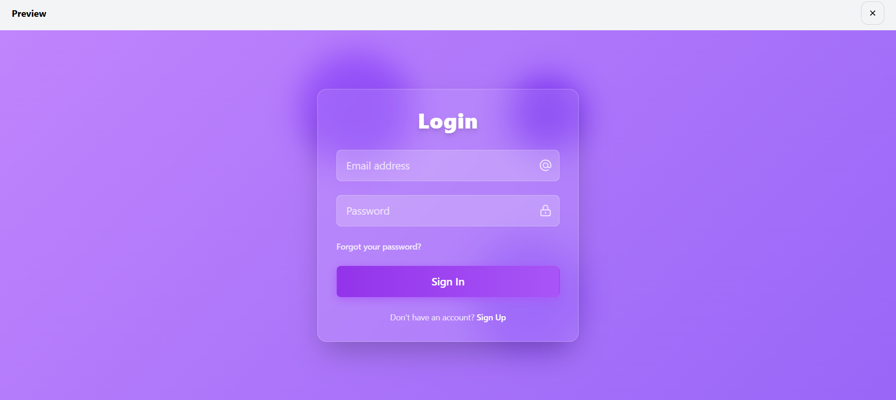

# UI with AI

**UI with AI** is a frontend-only React application that uses the **Google Gemini API** to instantly generate UI component code based on user descriptions.  
Users can choose a preferred framework, enter a short prompt, toggle light/dark mode, and the app generates complete frontend code along with a live preview.

This tool makes frontend UI creation simple, fast, and automated.


##  Dark & Light Mode

The project includes a **theme switcher** feature:
- Users can toggle between **Dark** and **Light** mode.
- Smooth UI transitions using TailwindCSS.


##  Features

-  **AI-Generated UI Components**
-  Powered by **Google Gemini API**
-  **Framework Options**
     - HTML + CSS  
     - HTML + Bootstrap  
     - HTML + TailwindCSS  
     - HTML + CSS + JavaScript  
     - React.js + TailwindCSS  
-  **Dark & Light Theme Toggle**
-  **Real-Time Live Preview in full window**
-  **One-Click Copy Code**
-  **Download Generated Code**
-  Input validation using toast notifications  
  - Shows **“Please describe your component first”** if prompt is empty
-  Fully responsive modern UI with TailwindCSS

---

##  Tech Stack

- React.js  
- TailwindCSS  
- Google Gemini API 

### 1️. Clone the repository
```bash
git clone https://github.com/ms-maheswari/UI-with-AI.git
cd UI-with-AI
```
### 2️. Install dependencies
```bash
npm install
```

### 3️. Add Gemini API Key
```bash
GEMINI_API_KEY=your_api_key_here
```

### 4️. Start the development server
```bash
npm start
```
## Screenshots

This is the Home page that contains navbar with title and button for theme



Code for the prompt



Output



Preview output in full screen


